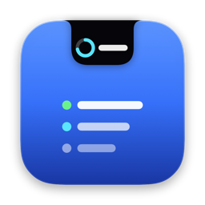
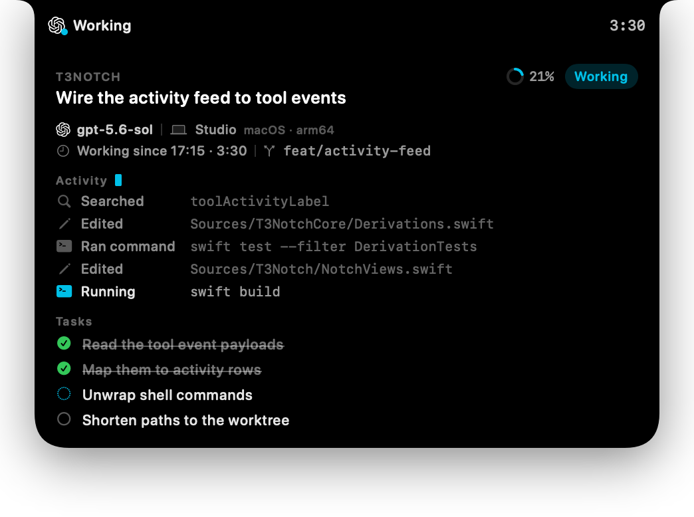
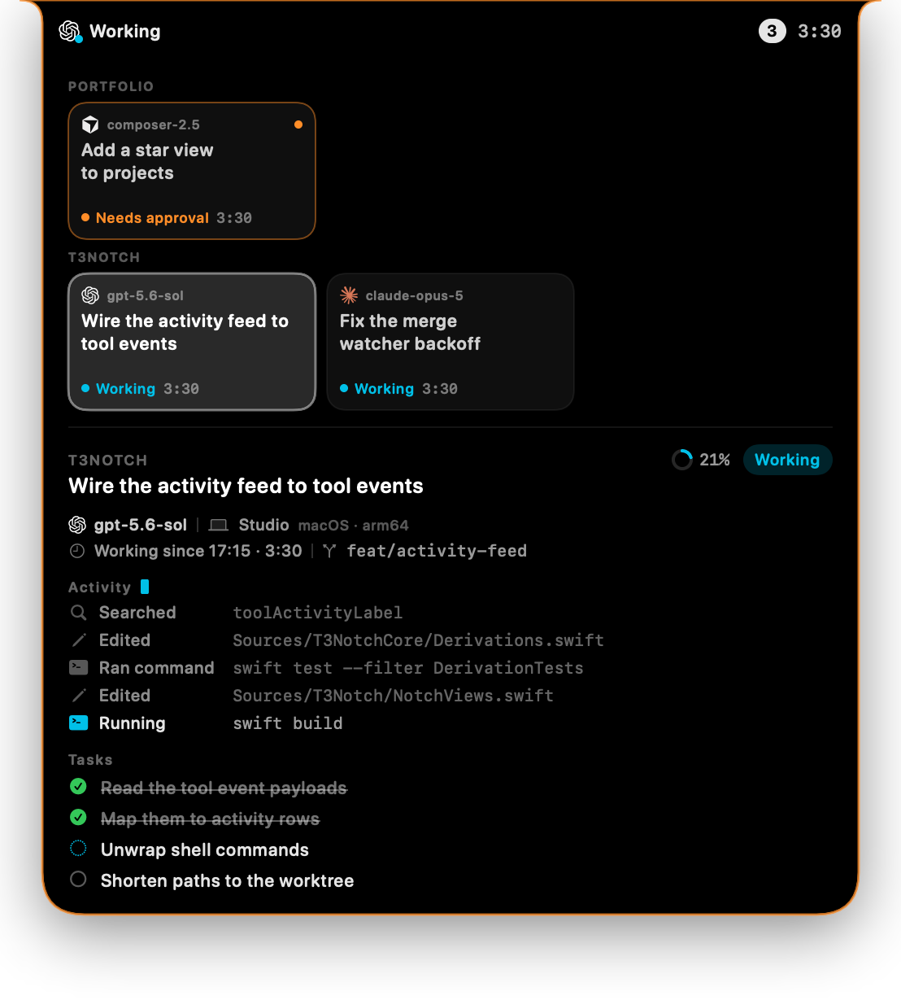
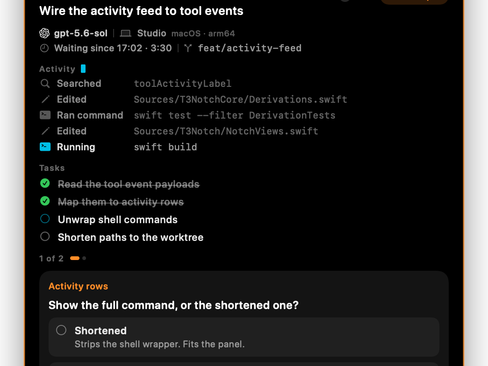
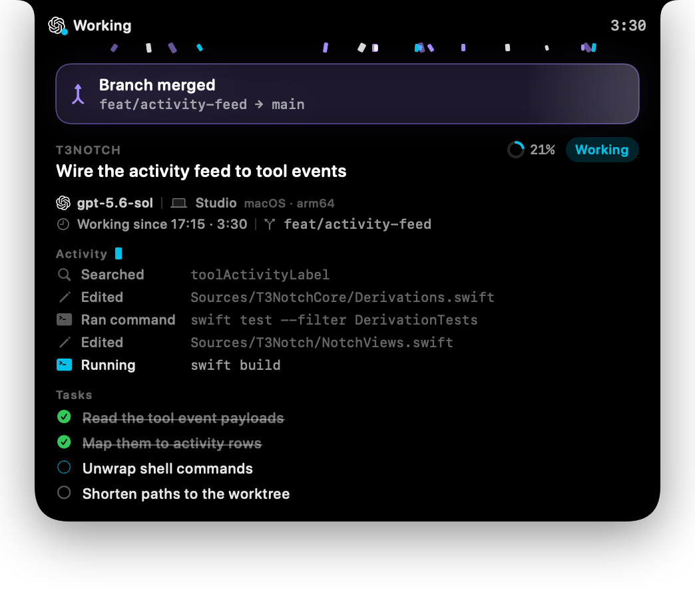

<div align="center">



# T3Notch

**Your agents, under the notch.**

An Alcove-style dynamic notch for [T3 Code](https://github.com/pingdotgg/t3code): live agent
progress, the task list, and approvals you can answer without switching windows.


</div>



T3Notch sits where your Mac's notch already is and answers the question you keep
alt-tabbing to check: what is the agent doing right now. It stays a small pill
while work runs, expands when you point at it, and opens itself when an agent
needs an answer.

> [!NOTE]
> T3Notch is an independent project and is not affiliated with, endorsed by, or
> sponsored by T3 or T3 Code.


## Highlights

- **The provider's own logo and model**, the machine the work is running on, the
  branch, and how long the current turn has been going.
- **An activity feed** of the last few things the agent did — the commands it ran
  and the files it changed, whatever is still in flight tinted.
- **The task list** from the agent's plan, with a tick animation as steps land.
- **Approvals and questions answered in place**, one slide at a time.
- **One card per agent** when several are running, grouped by machine and project.
- **Local and remote machines together**, with direct LAN/Tailscale/HTTPS pairing
  and an optional T3 Connect compatibility import.
- **Finished agents stay pinned** until you have actually looked at them.
- **Milestones get a moment**: a banner when a plan completes, confetti when a
  branch lands.
- **A control panel** for attention, animations, row counts and which display it
  lives on.
- **It updates itself** from GitHub releases, with a pre-release channel for
  builds that are not ready for everyone.

## A look around

### Several agents at once

Each running agent gets a pressable card, grouped under its project, and the panel
widens to fit them. Picking a card switches the detail below it.



### Questions, one at a time

Approvals and questions from T3 Code appear as a carousel: answer one and it slides
to the next, so a batch of questions doesn't become a wall of text. The panel opens
itself and outlines itself orange when something is waiting.



### When something lands

Finishing a plan step bounces its tick and sends a ring out of it. Finishing the
whole plan, or landing a branch, drops a banner into the panel and holds it open
for a few seconds — because these moments arrive exactly when nobody is hovering.



### Control panel

### First launch

The first run is a short tour, and the notch performs it rather than being described
in the abstract. A pretend agent moves in above the window and works through a plan
while you read, so every claim on screen is visible a few centimetres higher.

It then asks a question, in the notch, and waits — answering it there is how the
tour advances, and a second question slides in behind the first to show the queue.
Its plan finishes with a banner, two more pretend agents move in behind it — one in
another project, one wanting an answer — and pressing any of their cards swaps the
panel over to that agent, which is the whole trick of running several at once.

The tour ends on a connection test that is not a mock: every step makes the request
it describes, and failures print what came back along with the command to fix it.

Nothing in the walkthrough touches your real agents — polling is suspended for as
long as the window is open, and the pretend ones are discarded when it closes. They
are marked by a small **Demo** badge next to the notch's clock, which is the only
difference between the tour's panel and the real one. You can replay it any time
from **Settings → Quick start**.

## Install

Requires macOS 26+, Xcode 26.6+, and a running T3 Code with its local server on
`127.0.0.1:3773`.

```bash
export DEVELOPER_DIR=/Applications/Xcode.app/Contents/Developer
./Scripts/bundle.sh
open dist/T3Notch.app
```

`xcode-select` may point at the Command Line Tools, which cannot build a SwiftUI
app bundle — pin `DEVELOPER_DIR` as above.

For a token, T3Notch tries the Keychain, then `t3 auth session issue --token-only`,
then `npx -y t3@latest auth session issue --token-only`. If all three fail you can
paste a bearer token into the panel. Tokens live in the Keychain under
`gg.t3tools.t3notch`, and a saved one is dropped unread when the build that wrote it
is not the build reading it — otherwise every update would open the Keychain's
password prompt, which costs more than minting a fresh token does.

That signature-change behavior applies only to the auto-remintable local token.
Remote credentials use a separate, versioned Keychain vault and survive app
updates. T3Notch asks you to unlock that vault if macOS requires access again; it
never deletes a remote session merely because the app signature changed.

## Remote machines

T3Notch can monitor the T3 Code environments on a Mac mini, another MacBook, or
any compatible remote server. This is agent monitoring and response—not screen
sharing, a remote terminal, or general desktop control. The notch can:

- show local and remote agents at the same time;
- answer approvals and user questions on the machine that originated them;
- interrupt the current turn;
- deep-link to the corresponding remote T3 Code thread.

It does not start agents, manage projects, inspect remote worktrees, or expose
remote files. Merge watching remains local to this Mac.

### Direct pairing

On the machine running T3 Code, open **Settings → Connections**, enable network
access, and create a pairing link. For a headless Mac mini, `npx t3 serve` prints
the same link. On the Mac running T3Notch:

1. Open **T3Notch → Settings → Machines**.
2. Choose **Add…** and paste the complete pairing link.
3. Alternatively, use the advanced backend URL and pairing-code fields.

HTTPS or a private Tailnet is recommended. Plain HTTP is accepted for loopback;
a non-loopback HTTP endpoint requires a separate, persisted acknowledgement.
T3Notch reads the environment descriptor before consuming the one-time code,
exchanges it for a DPoP-bound session with only
`orchestration:read orchestration:operate`, verifies that session, and immediately
forgets the pairing code. Tokens and URL fragments are never included in an
opened thread URL.

See T3 Code's [Remote Access guide](https://github.com/pingdotgg/t3code/blob/main/docs/user/remote-access.md)
for LAN, Tailscale, and HTTPS server setup.

### T3 Connect compatibility import

Release builds embed the same public production Clerk and relay configuration as
T3 Code. **Import T3 Connect…** is enabled when T3 Code has a safe, recognized
signed-in session at `~/.t3/userdata/clerk-tokens.json`. Detection checks
ownership, permissions, file type, and schema without decrypting anything or
touching Keychain. An unsafe file produces an explanatory Machines row with a
copyable permission-fix command; T3Notch does not modify T3 Code’s file itself.
Before copying that command or importing a session, T3Notch requires confirmation
that the Mac is private and trusted. Do not use this compatibility import on a
public, shared, borrowed, or otherwise untrusted Mac: `chmod 600` limits access
to the current macOS account, but it cannot make a shared account safe.

Import is explicit. macOS may ask once for access to T3 Code's Electron Safe
Storage key; T3Notch copies the active Clerk client credential into its own
Keychain and never modifies T3 Code's file, Keychain item, account, or linked
environments. Production/nightly T3 Code storage is supported; dev-channel
storage is intentionally not.

T3 Connect is a compatibility adapter over the current upstream Clerk, relay, and
Electron contracts. If T3 Code rotates its encrypted session, Settings reports
that a new session is available and re-import remains a click. If T3 Code logs out
or Clerk rejects the copy, T3Notch purges only its imported copy and asks you to
import again. Direct and local monitoring continue independently.

Source builds use the production public values by default and may override all
three together for another deployment:

```bash
export T3CODE_CLERK_PUBLISHABLE_KEY=...
export T3CODE_CLERK_JWT_TEMPLATE=t3-relay
export T3CODE_RELAY_URL=https://relay.example.com
./Scripts/bundle.sh release
```

No Clerk secret key is accepted or embedded. See T3 Code's
[Connect configuration guide](https://github.com/pingdotgg/t3code/blob/main/docs/cloud/t3-connect-clerk.md).

### Connection behavior

Every enabled machine stays connected concurrently. Local discovery is
independent and remains usable through remote failures. Active shells poll at
800 ms; idle local and remote shells back off to 3 and 5 seconds respectively.
Failures use jittered exponential backoff from 500 ms to 30 seconds, with
immediate retry on wake, network restoration, and manual reconnect.

When direct and T3 Connect access report the same stable environment ID, they
appear as one logical machine. T3Notch prefers loopback, then a saved direct
endpoint, falls back to Connect after repeated direct failure or credential
expiry, probes direct every 60 seconds, and switches back after two successful
probes.

Remote profiles in `UserDefaults` contain only labels, endpoint URLs, enabled
state, and the insecure-HTTP acknowledgement. Access tokens, imported Clerk
credentials, relay tokens, and the app-scoped P-256 key live in the
`gg.t3tools.t3notch` Keychain vault. Diagnostics deliberately exclude
authorization headers, DPoP proofs, pairing credentials, Clerk tokens, OAuth
credential bodies, and private keys.

## Settings

**Settings…** in the menu bar item (⌘,) opens the control panel: dark rounded cards
with a hand-rolled switch, because a stock macOS settings window looks nothing like
the thing it configures. Every switch is wired to behaviour that actually reads it —
there are no decorative preferences.

| Setting | What reads it |
| --- | --- |
| Open on questions | the attention branch in `updatePresentation` |
| Play a sound | `playAttentionSound` |
| Keep finished agents pinned | `awaitsReview`, which is what pins a Done card |
| Celebrate tasks and merges | `celebrate`, and it dismisses anything on screen |
| Confetti on merges | the `ConfettiOverlay` in the expanded panel |
| Watch branches for merges | the 15s merge timer |
| Ask GitHub about pull requests | `MergeWatcher`'s forge: `.gh` or `.disabled` |
| Activity rows | `deriveRecentActivity(limit:)` |
| Task rows | the task list's row cap and its "+N more" |
| Display | `NotchGeometry.preferredScreen(named:)` |
| Launch at login | `SMAppService.mainApp` |
| Open in the T3 Code app | `openInT3Code`, before its browser fallback |
| Check automatically | the `Updater` poller |
| Download in the background | whether a found release is fetched without asking |
| Include pre-releases | `UpdateChannel`, which releases the feed will offer |

Values live in one struct persisted to `UserDefaults`, and writes go through a
single setter that saves and then calls `AgentStore.applySettings()`, so a flipped
switch takes effect immediately instead of on the next poll. Toggling the forge
setting rebuilds `MergeWatcher`, which deliberately forgets what it had seen: the
new watcher only reports merges from that moment on.

Two settings tell the truth rather than pretending. Launch at login reports what
`SMAppService` actually did — this app is ad-hoc signed, so registration can fail,
and the row shows the error and offers to open Login Items instead of leaving a
switch that looks on and does nothing. The display picker falls back to the
built-in notched screen whenever the chosen display is unplugged.

The Milestones section has **Preview** buttons for both animations, which is the
only way to see them without finishing a plan or merging a branch.

## Updating

T3Notch keeps itself current the way T3 Code does — a check shortly after launch,
then one on a timer — and reports the same states along the way: checking, up to
date, available, downloading, ready to install. The **Updates** card in the control
panel is where all of it surfaces, and the menu bar item grows an **Install … and
Relaunch** entry once a build is waiting.

Nothing restarts the app behind your back. A new build downloads on its own if you
leave that on, but installing it always waits for a click.

```
Updates
  T3Notch 1.0.0 (1)          [ What's new ]  [ Install and relaunch ]
  Version 1.1.0 is ready to install.
```

| Setting | Default | Effect |
| --- | --- | --- |
| Check automatically | on | 15s after launch, then every 6 hours |
| Download in the background | on | fetch as soon as a release appears |
| Include pre-releases | off | also take releases marked pre-release |

## How it works

- **T3NotchCore** — models, DPoP authorization, pairing and Connect clients,
  per-machine polling, multi-environment coordination, and derivations. No UI,
  and the only part under test.
- **T3Notch** — the AppKit panel and the SwiftUI views.

A session per enabled environment polls `/api/orchestration/shell` and
`/api/orchestration/threads/:id` adaptively. Composite environment/thread IDs keep
identical server-local IDs from colliding, and dispatch is always routed back to
the originating environment.
A WebSocket Effect-RPC transport can replace `PollingTransport` later behind the
same `T3Transport` protocol.

Provider logos are the same vector paths T3 Code's web app uses
(`apps/web/src/components/Icons.tsx`), parsed at runtime by `SVGPath.swift`, so they
stay pixel-faithful without bundling image assets. Machine name, OS and arch come
from `/.well-known/t3/environment`.

### Detail streams

Thread detail — activity, tasks, context, pending prompts — rides one long-lived
`AsyncStream` per focused thread. `threadDetail(_:)` hands out a *fresh* stream and
ends the previous one, so it must only be called when focus actually moves:
`setFocusedThread` deliberately does not call it, and `subscribeDetail` ignores
requests for the thread it already follows. Re-subscribing on every shell snapshot
silently blanks the whole lower half of the panel.

### The activity feed

Each `tool.started`/`tool.completed` pair folds into a single row. The two carry no
shared id, and fast commands log both inside the same millisecond with no
`sequence` field, so `orderedActivities` breaks ties by lifecycle order — without
that, half of all finished commands read as still running, and the same tie could
leave a resolved approval looking pending. Commands are unwrapped from the
`/bin/zsh -lc "…"` the agent runs them through, and changed-file paths are shown
relative to the worktree.

### Finished agents

A finished agent stays pinned as a Done card until it is reviewed, rather than
flashing past. Its review bar sits at the foot of the panel, under what the agent
actually did. Two things clear it: pressing **Open in T3 Code** in the notch, or
settling the thread in T3 Code (`settledAt`). T3 Code's own read state lives in
renderer `localStorage` (`threadLastVisitedAtById`) and is not exposed over HTTP,
so simply opening the thread in the T3 Code window cannot clear the notch. Threads
that had already finished when the notch launched are treated as seen, so the first
snapshot does not pin all of history.

**Open in T3 Code** brings the desktop app forward when it is running and only
falls back to a browser tab when it is not. T3 Code registers `t3code://` but
handles no thread routes — a second instance just reveals the existing window — so
the app lands on whatever thread it was already showing rather than the one from
the notch. Activation goes through LaunchServices (`NSWorkspace.openApplication`),
because `NSRunningApplication.activate()` is ignored for a caller that is not
itself active, which the non-activating notch panel never is. Turn **Open in the T3
Code app** off to always use the browser, which does deep-link to the exact thread.

### Detecting merges

Merge state is only served over T3 Code's WebSocket RPC (`subscribeVcsStatus`,
`getVcsStatus`) and this app speaks the HTTP orchestration API, so merges are found
without asking it. Two sources are consulted, the same two T3 Code uses:

- **The forge**, via `gh pr list --head <branch> --state merged --limit 1`, at most
  once a minute per branch. This is the only source that can see a squash merge:
  squashing rewrites the commits, so a squash-merged branch is *never* an ancestor
  of its base and no amount of local git will say otherwise. It is also what T3
  Code itself drives, which is why it auto-settles a thread the moment its change
  request reports `merged`. Only pull requests merged after launch count, so history
  stays quiet. A missing, unauthenticated or non-forge `gh` backs off for 15 minutes
  instead of spawning a process per poll.
- **The local repository**, for branches that land as a real merge commit or a
  fast-forward: `git rev-list --count <base>..<branch>` against the trunk and
  `origin/HEAD`, read-only, with `GIT_OPTIONAL_LOCKS=0`. Here a merge is reported
  only for a branch that was seen carrying commits the base lacked and later stopped
  carrying them, because "contained by main" alone is also true of two non-merges: a
  trunk-tracking thread, and a fresh worktree branch that has not committed yet.

Branches stay watched for up to 12 hours after their thread stops appearing in the
notch. A pull request is usually merged well after the agent stopped, and T3 Code
auto-settles the thread as soon as it sees the merge — so a watcher that only looked
at currently listed threads would go blind exactly when the merge landed.

### Self-update

electron-updater, which T3 Code hands its builds to Squirrel through, publishes a
`latest-mac.yml` manifest beside each build. A single-asset app needs no manifest:
the releases endpoint already carries the version, the notes and the download URL,
and it is the same list a person would read. Tags are compared as semver rather than
as strings, so `1.10.0` beats `1.9.0` and `1.1.0-beta.1` stays behind `1.1.0`; an
asset naming another architecture is not offered even when it is the only one there.

Installing is a download, a `ditto -x` into a temporary directory *on the app's own
volume*, and a single `replaceItemAt`. Same volume, because a swap across volumes is
a copy and a copy can fail half-way; one atomic replace, because a failure then
leaves the running app untouched rather than half-overwritten. The unpacked bundle
has to identify itself as this app and carry exactly the version the release
promised before any of that happens. A relaunch script waits for this process to
exit before reopening, so it cannot race the swap or leave two copies running.

`ditto` rather than any other unpacker: it is what wrote the zip, and it is the one
that keeps the code signature intact across the round trip. Updates are only offered
to a packaged app — a binary run straight from SwiftPM has no bundle to replace, and
the card says so instead of failing later.

### Clocks

Elapsed labels read an observable `clock` on the store that ticks once a second
while the panel is visible and some turn is still open. Reading `Date()` inside a
label looks equivalent but freezes: SwiftUI re-renders on observable change, not on
the passage of time, so the label only moved when something else did — which, with
the mouse held still, was nothing. Finished turns clamp to their `completedAt`
rather than counting up forever.

### Windows and the panel

The panel window is deliberately far taller than what it draws, so the panel can
spring open without resizing it, and it only accepts clicks while the pointer is
over the drawn part. Accepting them everywhere turns the empty remainder into an
invisible trap over whatever sits under the notch.

While a settings or quick start window is open the app switches from `.accessory` to
`.regular` activation and back again on close. An accessory app owns no Dock tile,
no ⌘Tab entry and no menu bar, so a window opened from a status item cannot be found
again once something covers it — and its own shortcuts (⌘C, ⌘W, ⌘Q) need a menu bar
to exist at all.

## Development

```bash
export DEVELOPER_DIR=/Applications/Xcode.app/Contents/Developer
swift build
swift test
```

Open `Package.swift` in Xcode for previews and debugging.

`Resources/AppIcon.icns` is generated, not hand-drawn: `Scripts/MakeAppIcon.swift`
draws it with SwiftUI against the app's own `NotchShape`, so the icon and the panel
cannot drift apart. Sizes below 64px drop the interior detail and 16px drops the
accent dot, because both turn to mush at that scale. The menu bar item draws the
same silhouette at 20×11 as a template image.

```bash
./Scripts/make-icon.sh   # rewrites Resources/AppIcon.icns
```

### Cutting a release

**Actions → Release → Run workflow**, on a macOS 26 runner with the same Xcode 26.6
the app is built with locally. Give it a version (`1.1.0`, or `1.1.0-beta.1` on the
prerelease channel) and it tests, builds, Developer ID signs, notarizes, staples,
checks the quarantined download with Gatekeeper, and publishes the tag with the zip
and its checksum.

The workflow reads the signing identity and App Store Connect API key from encrypted
GitHub Actions secrets. Their values never belong in the repository:
`DEVELOPER_ID_P12_BASE64`, `DEVELOPER_ID_P12_PASSWORD`,
`APP_STORE_CONNECT_API_KEY`, `APP_STORE_CONNECT_KEY_ID`, and
`APP_STORE_CONNECT_ISSUER_ID`.

Turn **publish** off for a dry run: the same build lands as a workflow artifact and
no tag is created. The version and the tag are checked before anything is built, so
a typo or an existing tag fails in seconds rather than after a full build.

`CFBundleShortVersionString` must match the tag exactly — it is what the updater
compares the downloaded bundle against, and a mismatch would ship an update that
refuses to install. The workflow enforces it; `Scripts/bundle.sh` reads `VERSION` and
`BUILD_NUMBER` from the environment for the same reason.
