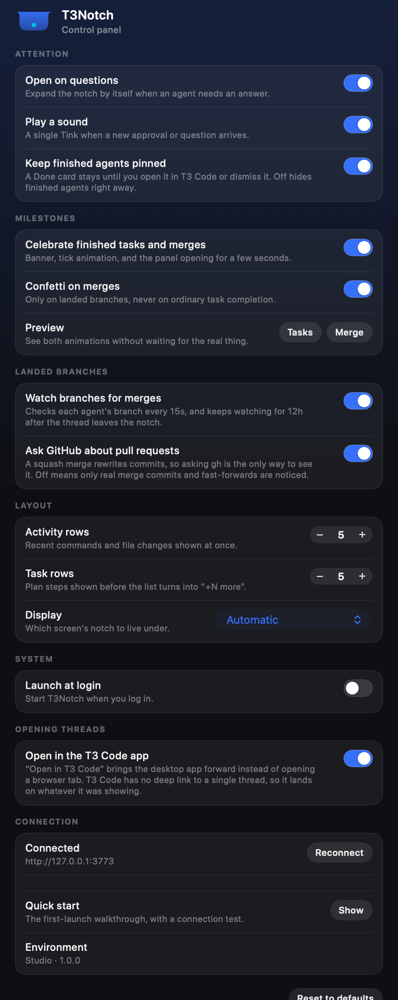
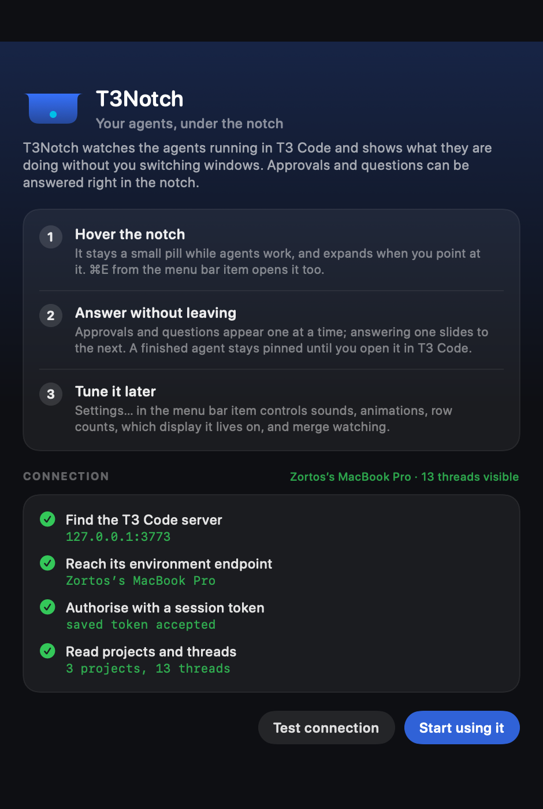

<div align="center">


# T3Notch

**Your agents, under the notch.**

An Alcove-style dynamic notch for [T3 Code](https://github.com/pingdotgg/t3code): live agent
progress, the task list, and approvals you can answer without switching windows.


</div>


T3Notch sits where your Mac's notch already is and answers the question you keep
alt-tabbing to check: what is the agent doing right now. It stays a small pill
while work runs, expands when you point at it, and opens itself when an agent
needs an answer.


## Highlights

- **The provider's own logo and model**, the machine the work is running on, the
  branch, and how long the current turn has been going.
- **An activity feed** of the last few things the agent did — the commands it ran
  and the files it changed, whatever is still in flight tinted.
- **The task list** from the agent's plan, with a tick animation as steps land.
- **Approvals and questions answered in place**, one slide at a time.
- **One card per agent** when several are running, grouped by project.
- **Finished agents stay pinned** until you have actually looked at them.
- **Milestones get a moment**: a banner when a plan completes, confetti when a
  branch lands.
- **A control panel** for attention, animations, row counts and which display it
  lives on.

## A look around

### Several agents at once

Each running agent gets a pressable card, grouped under its project, and the panel
widens to fit them. Picking a card switches the detail below it.


### Questions, one at a time

Approvals and questions from T3 Code appear as a carousel: answer one and it slides
to the next, so a batch of questions doesn't become a wall of text. The panel opens
itself and outlines itself orange when something is waiting.


### When something lands

Finishing a plan step bounces its tick and sends a ring out of it. Finishing the
whole plan, or landing a branch, drops a banner into the panel and holds it open
for a few seconds — because these moments arrive exactly when nobody is hovering.


### Control panel



### First launch

The first run explains the three things worth knowing and tests the connection for
real: every step makes the request it describes, and failures print what came back
along with the command to fix it.



While it is open the notch takes part rather than being described in the abstract:
it holds a **Quick start** pill, opens showing whichever step you point at, and
echoes the connection test as it runs.

## Install

Requires macOS 26+, Xcode 26.6+, and a running T3 Code with its local server on
`127.0.0.1:3773`.

```bash
export DEVELOPER_DIR=/Applications/Xcode.app/Contents/Developer
./Scripts/bundle.sh
open dist/T3Notch.app
```

`xcode-select` may point at the Command Line Tools, which cannot build a SwiftUI
app bundle — pin `DEVELOPER_DIR` as above.

For a token, T3Notch tries the Keychain, then `t3 auth session issue --token-only`,
then `npx -y t3@latest auth session issue --token-only`. If all three fail you can
paste a bearer token into the panel. Tokens live in the Keychain under
`gg.t3tools.t3notch`.

## Settings

**Settings…** in the menu bar item (⌘,) opens the control panel: dark rounded cards
with a hand-rolled switch, because a stock macOS settings window looks nothing like
the thing it configures. Every switch is wired to behaviour that actually reads it —
there are no decorative preferences.

| Setting | What reads it |
| --- | --- |
| Open on questions | the attention branch in `updatePresentation` |
| Play a sound | `playAttentionSound` |
| Keep finished agents pinned | `awaitsReview`, which is what pins a Done card |
| Celebrate tasks and merges | `celebrate`, and it dismisses anything on screen |
| Confetti on merges | the `ConfettiOverlay` in the expanded panel |
| Watch branches for merges | the 15s merge timer |
| Ask GitHub about pull requests | `MergeWatcher`'s forge: `.gh` or `.disabled` |
| Activity rows | `deriveRecentActivity(limit:)` |
| Task rows | the task list's row cap and its "+N more" |
| Display | `NotchGeometry.preferredScreen(named:)` |
| Launch at login | `SMAppService.mainApp` |
| Open in the T3 Code app | `openInT3Code`, before its browser fallback |

Values live in one struct persisted to `UserDefaults`, and writes go through a
single setter that saves and then calls `AgentStore.applySettings()`, so a flipped
switch takes effect immediately instead of on the next poll. Toggling the forge
setting rebuilds `MergeWatcher`, which deliberately forgets what it had seen: the
new watcher only reports merges from that moment on.

Two settings tell the truth rather than pretending. Launch at login reports what
`SMAppService` actually did — this app is ad-hoc signed, so registration can fail,
and the row shows the error and offers to open Login Items instead of leaving a
switch that looks on and does nothing. The display picker falls back to the
built-in notched screen whenever the chosen display is unplugged.

The Milestones section has **Preview** buttons for both animations, which is the
only way to see them without finishing a plan or merging a branch.

## How it works

- **T3NotchCore** — models, HTTP client, polling transport, derivations. No UI, and
  the only part under test.
- **T3Notch** — the AppKit panel and the SwiftUI views.

v1 polls `/api/orchestration/shell` and `/api/orchestration/threads/:id` adaptively.
A WebSocket Effect-RPC transport can replace `PollingTransport` later behind the
same `T3Transport` protocol.

Provider logos are the same vector paths T3 Code's web app uses
(`apps/web/src/components/Icons.tsx`), parsed at runtime by `SVGPath.swift`, so they
stay pixel-faithful without bundling image assets. Machine name, OS and arch come
from `/.well-known/t3/environment`.

### Detail streams

Thread detail — activity, tasks, context, pending prompts — rides one long-lived
`AsyncStream` per focused thread. `threadDetail(_:)` hands out a *fresh* stream and
ends the previous one, so it must only be called when focus actually moves:
`setFocusedThread` deliberately does not call it, and `subscribeDetail` ignores
requests for the thread it already follows. Re-subscribing on every shell snapshot
silently blanks the whole lower half of the panel.

### The activity feed

Each `tool.started`/`tool.completed` pair folds into a single row. The two carry no
shared id, and fast commands log both inside the same millisecond with no
`sequence` field, so `orderedActivities` breaks ties by lifecycle order — without
that, half of all finished commands read as still running, and the same tie could
leave a resolved approval looking pending. Commands are unwrapped from the
`/bin/zsh -lc "…"` the agent runs them through, and changed-file paths are shown
relative to the worktree.

### Finished agents

A finished agent stays pinned as a Done card until it is reviewed, rather than
flashing past. Two things clear it: pressing **Open in T3 Code** in the notch, or
settling the thread in T3 Code (`settledAt`). T3 Code's own read state lives in
renderer `localStorage` (`threadLastVisitedAtById`) and is not exposed over HTTP,
so simply opening the thread in the T3 Code window cannot clear the notch. Threads
that had already finished when the notch launched are treated as seen, so the first
snapshot does not pin all of history.

**Open in T3 Code** brings the desktop app forward when it is running and only
falls back to a browser tab when it is not. T3 Code registers `t3code://` but
handles no thread routes — a second instance just reveals the existing window — so
the app lands on whatever thread it was already showing rather than the one from
the notch. Activation goes through LaunchServices (`NSWorkspace.openApplication`),
because `NSRunningApplication.activate()` is ignored for a caller that is not
itself active, which the non-activating notch panel never is. Turn **Open in the T3
Code app** off to always use the browser, which does deep-link to the exact thread.

### Detecting merges

Merge state is only served over T3 Code's WebSocket RPC (`subscribeVcsStatus`,
`getVcsStatus`) and this app speaks the HTTP orchestration API, so merges are found
without asking it. Two sources are consulted, the same two T3 Code uses:

- **The forge**, via `gh pr list --head <branch> --state merged --limit 1`, at most
  once a minute per branch. This is the only source that can see a squash merge:
  squashing rewrites the commits, so a squash-merged branch is *never* an ancestor
  of its base and no amount of local git will say otherwise. It is also what T3
  Code itself drives, which is why it auto-settles a thread the moment its change
  request reports `merged`. Only pull requests merged after launch count, so history
  stays quiet. A missing, unauthenticated or non-forge `gh` backs off for 15 minutes
  instead of spawning a process per poll.
- **The local repository**, for branches that land as a real merge commit or a
  fast-forward: `git rev-list --count <base>..<branch>` against the trunk and
  `origin/HEAD`, read-only, with `GIT_OPTIONAL_LOCKS=0`. Here a merge is reported
  only for a branch that was seen carrying commits the base lacked and later stopped
  carrying them, because "contained by main" alone is also true of two non-merges: a
  trunk-tracking thread, and a fresh worktree branch that has not committed yet.

Branches stay watched for up to 12 hours after their thread stops appearing in the
notch. A pull request is usually merged well after the agent stopped, and T3 Code
auto-settles the thread as soon as it sees the merge — so a watcher that only looked
at currently listed threads would go blind exactly when the merge landed.

### Clocks

Elapsed labels read an observable `clock` on the store that ticks once a second
while the panel is visible and some turn is still open. Reading `Date()` inside a
label looks equivalent but freezes: SwiftUI re-renders on observable change, not on
the passage of time, so the label only moved when something else did — which, with
the mouse held still, was nothing. Finished turns clamp to their `completedAt`
rather than counting up forever.

### Windows and the panel

The panel window is deliberately far taller than what it draws, so the panel can
spring open without resizing it, and it only accepts clicks while the pointer is
over the drawn part. Accepting them everywhere turns the empty remainder into an
invisible trap over whatever sits under the notch.

While a settings or quick start window is open the app switches from `.accessory` to
`.regular` activation and back again on close. An accessory app owns no Dock tile,
no ⌘Tab entry and no menu bar, so a window opened from a status item cannot be found
again once something covers it — and its own shortcuts (⌘C, ⌘W, ⌘Q) need a menu bar
to exist at all.

## Development

```bash
export DEVELOPER_DIR=/Applications/Xcode.app/Contents/Developer
swift build
swift test
```

Open `Package.swift` in Xcode for previews and debugging.

`Resources/AppIcon.icns` is generated, not hand-drawn: `Scripts/MakeAppIcon.swift`
draws it with SwiftUI against the app's own `NotchShape`, so the icon and the panel
cannot drift apart. Sizes below 64px drop the interior detail and 16px drops the
accent dot, because both turn to mush at that scale. The menu bar item draws the
same silhouette at 20×11 as a template image.

```bash
./Scripts/make-icon.sh   # rewrites Resources/AppIcon.icns
```
